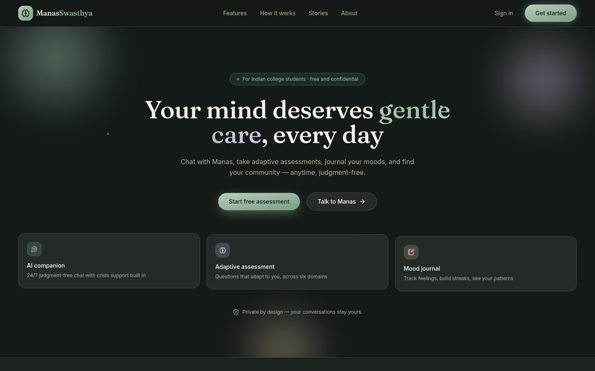
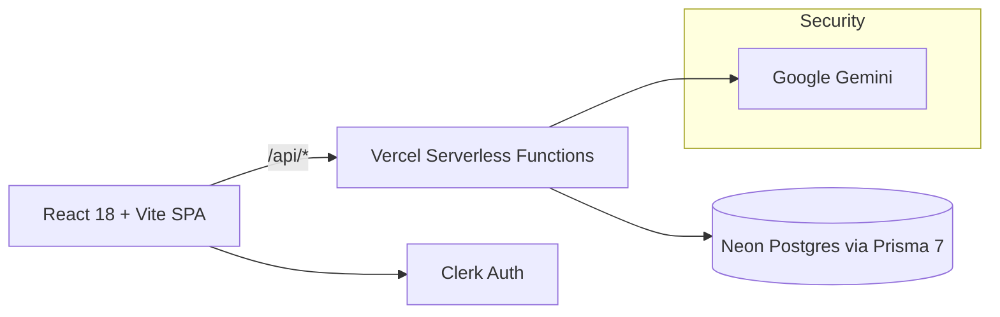

# ManasSwasthya 🧠🌿

**AI-powered mental wellness companion for Indian college students** — free, confidential, judgment-free.

> *ManasSwasthya* means "mental wellness" in Sanskrit.



## Why

1 in 4 college students in India experiences significant mental health challenges — yet fewer than 10% ever seek help, blocked by cost, stigma, and lack of awareness. ManasSwasthya removes all three barriers with a private AI companion that is always available.

## Features

- **🤖 AI Companion (Manas)** — 24/7 empathetic chat powered by Gemini, with real-time crisis detection that surfaces Indian helplines (KIRAN, iCall) instantly. Supports English, Hindi, and Hinglish, plus voice input.
- **🧭 Adaptive Assessment** — not a static questionnaire: each of 12 questions is generated from your previous answers across six wellbeing domains (academic, social, emotional, behavioral, cognitive, physical), ending in an animated score report you can download as PDF.
- **📓 Mood Journal** — rich journal editor with templates, stickers, voice notes, and a mood calendar; AI surfaces gentle insights from your own words. Entries sync to the cloud.
- **📈 Wellness Dashboard** — mood trends, wellness score with delta tracking, check-in streaks, and recent activity in one calm view.
- **👥 Peer Community** — interest groups, live events with registration, and trained peer mentors.
- **💊 Medicine AI** — plain-language information about any medicine from a name or a photo of the packaging.
- **🌐 4 languages** · **📱 PWA installable** · **🌙 Dark mode**

## Architecture



- **Frontend:** React 18, TypeScript, Tailwind + custom design-token system (cream/sage/lavender "calm premium" theme, dark aurora landing), framer-motion animations, TanStack Query, route-level code splitting.
- **Backend:** Vercel serverless functions (`api/`), zod-validated, with a thin Express wrapper (`server.ts`) for local dev. All Gemini calls are server-side — **no AI keys ever reach the browser** — with per-user rate limiting.
- **Data:** Neon Postgres through Prisma 7 (pg driver adapter).
- **Auth:** Clerk.

## Getting started

```bash
git clone <repo>
cd nexus-mind-care
npm install
cp .env.example .env       # fill in the 3 required keys
npx prisma generate
npx prisma db push          # first time only
node scripts/seed.mjs       # optional demo data

npm run server              # API on :3001
npm run dev                 # Vite on :8080 (proxies /api)
```

| Env var | Where to get it | Exposed to browser? |
|---|---|---|
| `VITE_CLERK_PUBLISHABLE_KEY` | dashboard.clerk.com → API keys | Yes (publishable) |
| `DATABASE_URL` | console.neon.tech | No |
| `GEMINI_API_KEY` | aistudio.google.com/apikey | **No — server only** |

## Deploying to Vercel

1. Push the repo to GitHub and import it in Vercel (framework: **Vite** — `vercel.json` is already configured).
2. Add the three environment variables above in Vercel → Settings → Environment Variables.
3. Deploy. The SPA is served statically; everything under `api/` becomes serverless functions.

## Testing & quality

```bash
npm test        # vitest — schema, API handler (live DB), reducer, streak, client tests
npm run lint    # eslint — passes with 0 errors, 0 warnings
npm run build   # vite production build, vendor-split chunks
npm run db:check  # verifies DB connectivity + table counts
```

## Safety design

ManasSwasthya is a wellbeing companion, **not** a medical device. Crisis language is detected both client-side (instant, offline keyword match incl. Hinglish) and server-side (model-assisted), and always surfaces KIRAN (1800-599-0019) and iCall (9152987821). The AI is instructed never to diagnose or prescribe.

---

Built by Aniket · © 2026 ManasSwasthya
