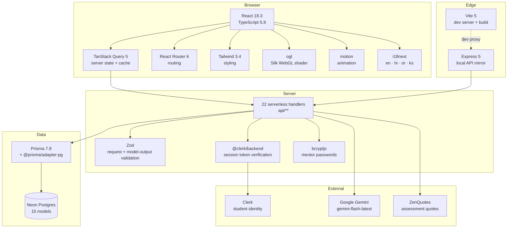
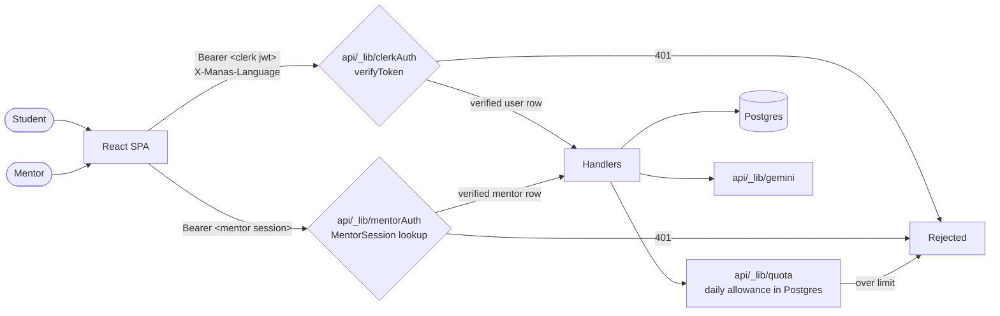

# Manas Swasthya

A mental-health platform for Indian college students. Mood tracking, a private
journal, a validated self-assessment, peer circles, one-to-one mentoring,
bookable counselling, a resource library, an AI companion, and a medicine
identifier — in one place, in four languages.

Built as a full-stack TypeScript application: React on the front, serverless
handlers over Postgres on the back, Clerk for identity, Gemini for the AI
features.

```
516 tests · 32 suites · 0 lint errors · 0 type errors · 22 API endpoints · 4 languages
```

---

## Contents

- [What it does](#what-it-does)
- [Demos](#demos)
- [Tech stack](#tech-stack)
- [Architecture](#architecture)
- [Folder structure](#folder-structure)
- [Setup](#setup)
- [Security](#security)
- [Testing](#testing)
- [Further reading](#further-reading)

---

## What it does

| Section | What a student can do |
|---|---|
| **Dashboard** | A daily ritual that changes through the day, a mood check-in, a rhythm chart over 90 days, a wellness score, their next booked session, recent journal entries, and an activity they have joined. |
| **Chat** | An AI companion with server-side crisis detection. If a message reads as distress, helplines surface immediately rather than waiting on the model. |
| **Journal** | A rich notebook: two themes, stickers, photos, audio clips, bold/italic text, a calendar view, and an AI mood read that lands on the calendar and feeds a live mood index. |
| **Assessment** | Twelve fixed questions across six domains of student life, plus AI follow-ups chosen from the answers. Scored, tracked over time, with a radar against last time and a "what changed" narrative. |
| **Booking** | Browse consultants, book a session, redeem a waiver code or claim the student registration waiver. Pricing is decided entirely server-side. |
| **Resources** | A catalogue with per-type viewers — a PDF reader, a music player with a spinning disc, a video player, an article reader — searchable by name or by code. |
| **Community** | Three tabs behind one page: assigned and chosen mentors with private 1:1 threads, peer circles with group chat, and joinable activities. Mentors sign in separately. |
| **Medicine AI** | Photograph a strip or type a name; get what it treats, how it is taken, what would mean stopping, and how it interacts with mental-health medication. Five checks a day. |

---

## Demos

In the order the sections were built.

### Landing page

https://github.com/aniket-311211/Manas-Swasthya-2.0/raw/main/docs/demo/00-landing-page.mp4

### 1 · Dashboard

The editorial bento layout: daily ritual, mood check-in, rhythm, wellness score,
next session, journal snippets, community and resources.

https://github.com/aniket-311211/Manas-Swasthya-2.0/raw/main/docs/demo/01-dashboard.mp4

### 2 · Chat

AI companion with crisis detection running server-side on every message.

https://github.com/aniket-311211/Manas-Swasthya-2.0/raw/main/docs/demo/02-chat.mp4

### 3 · Journal

Themes, stickers, media, rich text, calendar, and the AI mood read.

https://github.com/aniket-311211/Manas-Swasthya-2.0/raw/main/docs/demo/03-journal.mp4

### 4 · Assessment

Fixed item bank, AI follow-ups, radar against last time, answer-latency signal.

https://github.com/aniket-311211/Manas-Swasthya-2.0/raw/main/docs/demo/04-assessment.mp4

### 5 · Booking

Consultant deck, session booking, server-side pricing and fee waivers.

https://github.com/aniket-311211/Manas-Swasthya-2.0/raw/main/docs/demo/05-booking.mp4

### 6 · Resources

MagicBento cards, category filtering, code search, per-type viewers.

https://github.com/aniket-311211/Manas-Swasthya-2.0/raw/main/docs/demo/06-resources.mp4

### 7 · Community

Mentors, peer circles and events behind one sub-navigation.

https://github.com/aniket-311211/Manas-Swasthya-2.0/raw/main/docs/demo/07-community.mp4

### 8 · Medicine AI

Photo or name in, a structured medicine report out, with a daily allowance.

https://github.com/aniket-311211/Manas-Swasthya-2.0/raw/main/docs/demo/08-medicine-ai.mp4

> GitHub serves these as downloads rather than inline players. To get inline
> playback, drag each file into a GitHub issue comment and paste the resulting
> `user-attachments` URL back into this README.

---

## Tech stack



| Layer | Choice | Why |
|---|---|---|
| Framework | React 18.3 + TypeScript 5.8 | Strict mode on; 0 type errors across ~300 files |
| Build | Vite 5 | Dev proxy sends `/api` to the local Express mirror |
| Server state | TanStack Query 5 | Shared cache keys mean a write on one page refreshes another |
| Styling | Tailwind 3.4 | Light-only; `color-scheme: only light`, no `dark:` variants |
| Backgrounds | `ogl` | react-bits Silk ported from React Three Fiber, which needs React 19 |
| Animation | `motion` | `useReducedMotion` guards every animation |
| Auth (students) | Clerk | Session tokens verified server-side against `CLERK_SECRET_KEY` |
| Auth (mentors) | bcrypt + opaque tokens | Separate system; server-side sessions so they can be revoked |
| Database | Neon Postgres + Prisma 7.8 | Driver adapter `@prisma/adapter-pg` |
| Validation | Zod | Every request body and every model response |
| AI | Gemini `gemini-flash-latest` | Chat, journal mood, assessment follow-ups, medicine |
| i18n | i18next | English, Hindi, Odia, Kashmiri — with RTL for Kashmiri |
| Tests | Vitest | 516 tests, node environment, live database |

---

## Architecture



**The rule the whole backend follows:** identity is never taken from the request
body. Every user-scoped endpoint resolves the caller through
`requireVerifiedUser(req, res)`, which verifies a Clerk-signed session token. A
`clerkId` in a body or query string is a claim anyone can make, and treating it
as proof is how the earlier version of this codebase leaked journals and let
strangers spend the owner's Gemini quota.

Order of operations on a paid endpoint is deliberate: **verify identity →
reserve the quota → spend money.** Doing any of those later leaves a way to get
the expensive part for free.

Full detail, including the data model and every endpoint's identity source, is in
[`docs/ARCHITECTURE.md`](docs/ARCHITECTURE.md).

---

## Folder structure

```
ManasSwasthya2.0/
├── api/                          22 serverless handlers (Vercel-style)
│   ├── _lib/                     shared server code — not routable
│   │   ├── clerkAuth.ts          Clerk token verification, requireVerifiedUser
│   │   ├── mentorAuth.ts         bcrypt + MentorSession, LOCKED_PASSWORD
│   │   ├── quota.ts              database-backed daily AI allowance (IST days)
│   │   ├── medicine.ts           medicine prompt, output schema, image sniffing
│   │   ├── language.ts           validated language header → prompt instruction
│   │   ├── gemini.ts             model client with retries
│   │   ├── schemas.ts            every Zod request schema
│   │   ├── http.ts               ok/fail/parseBody/methodGuard/withErrors
│   │   ├── prisma.ts             singleton client + pg adapter
│   │   ├── assignMentor.ts       one mentor per student at sign-up
│   │   └── ratelimit.ts          in-memory window limiter
│   ├── ai/                       chat · analyze · assessment · medicine
│   ├── mentors/                  index · auth · signup · threads
│   ├── community/                groups · join · messages
│   ├── chat/                     rooms · messages
│   ├── assessments · bookings · events · journal · medicine · mood · quotes
│   ├── users.ts                  Clerk → local user sync
│   └── health.ts
│
├── src/
│   ├── pages/                    one file per route
│   ├── features/                 the substance of each section
│   │   ├── assessment/           item bank, scoring, history, radar, quotes
│   │   ├── booking/              consultant deck, sheet, my-bookings, pricing view
│   │   ├── chat/                 composer, bubbles, crisis banner, orb
│   │   ├── community/            mentors, circles, activities, mentor console
│   │   ├── journal/              editor, browse, AI mood, themes, media, prefs
│   │   ├── medicine/             report, image preparation, theme
│   │   └── resources/            catalogue, media resolution, players, grid
│   ├── components/
│   │   ├── dashboard/            the bento cards
│   │   ├── shell/                AppShell, AppTopBar, shared theme tokens
│   │   ├── Silk/ MagicBento/     vendored react-bits visuals
│   │   └── ui/                   10 shadcn primitives actually in use
│   ├── auth/                     Clerk sign-in / sign-up / sign-out pages
│   ├── lib/                      api client, languages, crisis, resources, utils
│   ├── types/                    shared API types
│   └── i18n.ts                   locale loading, direction, persistence
│
├── prisma/schema.prisma          15 models
├── locales/{en,hi,or,ks}/        76 strings each, key-for-key identical
├── tests/                        32 suites, 516 tests
├── scripts/                      seed-mentors · seed-events · db-check
├── docs/                         architecture · setup · security · demo videos
└── server.ts                     Express mirror of the serverless handlers
```

---

## Setup

Short version. The long version, including how to get each key and what can go
wrong, is in [`docs/SETUP.md`](docs/SETUP.md).

**Requires** Node 20+, a Neon (or any) Postgres database, a Clerk application,
and a Google Gemini API key.

```bash
git clone https://github.com/aniket-311211/Manas-Swasthya-2.0.git
cd Manas-Swasthya-2.0
npm install

cp .env.example .env          # then fill it in — see docs/SETUP.md
npx prisma generate
npx prisma db push            # first run only

npm run dev:all               # API on :3001, Vite on :8080
```

Open <http://localhost:8080>.

Optional demo data:

```bash
MENTOR_SEED_PASSWORD='choose-something-long' node scripts/seed-mentors.mjs
node scripts/seed-events.mjs   # activities dated relative to now; re-run when stale
```

---

## Security

This repository is public. Everything sensitive is configuration, not code.

**Nothing secret is committed.** `.env` is git-ignored and has never been
committed — verified against the full history, not just the working tree.
`.env.example` carries names and placeholders only.

**Waiver codes and mentor invite codes come from the environment.** They used to
be literals in `api/bookings/index.ts` and `api/mentors/signup.ts`. In a public
repository a hardcoded discount code is a discount anyone can redeem, and a
hardcoded mentor invite code means a stranger can register as a counsellor and
start receiving messages from students in distress. Both now read from
`BOOKING_COUPON_CODES` and `MENTOR_INVITE_CODES`, and both **default to empty** —
a fresh clone has no working codes and accepts no mentor signups until you
configure your own.

**If you clone this, you get no credentials.** You will need your own Clerk
application, your own database, and your own Gemini key. Nothing in this
repository will authenticate against anyone else's deployment.

The threat model, the full endpoint-by-endpoint identity table, and the list of
vulnerabilities that were found and closed are in
[`docs/SECURITY.md`](docs/SECURITY.md).

---

## Testing

```bash
npm test                                   # 516 tests
npx eslint src/ api/ tests/                # 0 errors
npx tsc --noEmit -p tsconfig.app.json      # 0 errors
npm run build
```

The suite talks to a real database rather than mocking Prisma, so `DATABASE_URL`
must be set. Clerk's signature check is the one thing stubbed —
`tests/setup/clerk.ts` replaces `verifyToken` only, so every other part of the
auth path runs for real, including the 401s.

Coverage is weighted towards the things that would hurt: who can read a private
thread, whether a booking price can be forged, whether the last seat in a session
can be sold twice, whether a refusal from the medicine model is charged or
refunded.

---

## Further reading

| Document | What is in it |
|---|---|
| [`docs/ARCHITECTURE.md`](docs/ARCHITECTURE.md) | Data model, every endpoint, request lifecycle, front-end patterns, design system |
| [`docs/SETUP.md`](docs/SETUP.md) | Every environment variable, where to get each key, common failures |
| [`docs/SECURITY.md`](docs/SECURITY.md) | Threat model, identity table, what was fixed, what is still open |

---

## Licence

No licence file is included, so by default all rights are reserved: others may
view the code but not reuse it. Add a `LICENSE` if you want to permit reuse —
MIT is the usual choice for a project like this.
